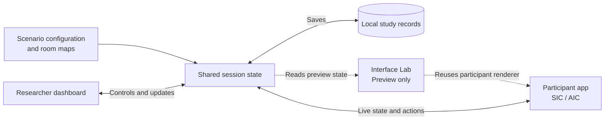

# APEX

APEX (Adaptive Pre-Arrival Experience) is a research prototype for studying
rule-based adaptive mobile interfaces during the pre-arrival stage of an
autonomous shuttle journey. It was developed for a master's thesis and supports
a controlled comparison between a Static Interface Condition (SIC) and an
Adaptive Interface Condition (AIC).

The prototype is one locally hosted SvelteKit application. It connects a
participant-facing Progressive Web App (PWA), a researcher dashboard, an
Interface Lab for side-by-side design review, configurable room maps, and a
local JSON data store. The interface uses the VERDĒ design language; the design
language itself was not part of the evaluation.

APEX is an experimental prototype, not a production transport service. It does
not connect to a vehicle, booking provider, or live fleet system.

## Prototype scope

The implemented journey covers:

1. ride-option selection and request;
2. shuttle assignment;
3. waiting and route guidance;
4. a revised pickup time;
5. near-arrival guidance; and
6. arrival and boarding preparation.

SIC and AIC receive the same scenario, ride options, service events, timing,
vehicle information, and available actions. SIC keeps a stable information
hierarchy as values change. AIC uses deterministic rules to change information
priority, module order, visual emphasis, map behaviour, wording, motion, audio,
and notification cues according to the active journey phase and context
triggers. The prototype does not use machine learning or user profiling to make
these decisions.

## Application surfaces

- `/app` presents the mobile participant interface. Research condition labels
  remain hidden from participants.
- `/dashboard` provides participant registration, condition-order and map
  selection, scenario setup, session monitoring, event review, researcher
  notes, technical-issue recording, recovery controls, and Wizard-of-Oz (WoZ)
  location control.
- `/interface-lab` renders SIC and AIC side by side using the real participant
  component. It supports phase, ride-state, map, location, event, and trigger
  previews without writing participant study data.
- `/` links to the three application surfaces.

The WoZ controls can simulate a participant's position and direction on the
configured pedestrian route. The study used WoZ input only for participant
location; scenario timing and shuttle movement remained system-controlled.

## Architecture

One `ParticipantRide` component renders both interface conditions from the
active condition, journey phase, scenario, ride state, map, location, and
trigger state. The participant interface and dashboard read and update the same
server-side session. SvelteKit server routes persist configuration, maps,
session state, participant records, and events as local files.



The main implementation areas are:

- `src/routes/app/`: participant PWA;
- `src/routes/dashboard/`: researcher dashboard and map editor;
- `src/routes/interface-lab/`: parallel condition preview;
- `src/routes/api/`: local state, participant, map, event, automation, and live
  update endpoints;
- `src/lib/components/`: shared interface and map components;
- `src/lib/server/study-store.ts`: scenario, session, map, trigger, automation,
  and persistence logic; and
- `src/lib/types.ts`: shared data and state definitions.

## Requirements

- Node.js `20.19+` or `22.12+`;
- Yarn Classic `1.22`; and
- OpenSSL when generating a local HTTPS certificate.

## Install and run

From this directory:

```sh
yarn install --frozen-lockfile
yarn run dev --host 0.0.0.0
```

The development server prints the local and network addresses. Open the
researcher dashboard on the host computer and the participant application on a
phone connected to the same local network:

- Researcher dashboard: `http://localhost:5173/dashboard`
- Participant application: `http://<host-address>:5173/app`

For a production-style local build:

```sh
yarn run check
yarn run lint
yarn run build
HOST=0.0.0.0 PORT=4173 yarn run start
```

When APEX remains inside the complete thesis repository, the root `Makefile`
also provides `app-dev`, `app-check`, `app-build`, `app-start`, and
`app-dev-https` targets.

## Local HTTPS and iPhone PWA use

Some browser capabilities, including Home Screen notifications on iOS, require
a secure context. Generate a development certificate for the host computer's
local-network address:

```sh
node scripts/generate-local-https-cert.mjs --host 192.168.x.x
APEX_HTTPS=1 yarn run dev --host 0.0.0.0
```

The generated certificates remain under `data/certs/` and are ignored by Git.
Install and trust the generated local certificate authority only on a dedicated
test device, then open `https://<host-address>:5173/app` and add the application
to the Home Screen.

The participant interface contains optional Web Notification and Vibration API
support. The iOS browser used in the study did not expose the Vibration API, so
haptic or vibration feedback was not part of the evaluated conditions.

## Configuration and maps

`data/config/default-scenario.yml` defines the default timing, phase text, ride
options, vehicle information, and other shared scenario values.
The dashboard can adjust scenario values before a session starts.

Room maps are JSON documents in `data/maps/`. The dashboard map editor supports
room geometry, pedestrian and shuttle paths, pickup points, obstacles,
condition-specific viewports, and tagged trigger zones. A session locks its
selected map when the participant block starts.

## Session workflow

1. Start APEX and open `/dashboard` and `/app`.
2. Register a pseudonymous participant ID, assign the condition order, and
   select a map.
3. Review the scenario settings and start the registered session.
4. The participant selects and requests a ride; the request starts the scripted
   scenario timing.
5. Monitor the session from the dashboard and update the simulated participant
   location when required.
6. Complete the first block, switch to the second condition, and repeat.
7. Confirm that the participant record contains both completed blocks before
   archiving the study data in an approved research location.

The dashboard also exposes pause, resume, phase-jump, and technical-issue
controls for setup and recovery. These controls should be used only according
to the intended study protocol.

## Local data and privacy

APEX does not require an external database or cloud service. It writes study
state and interaction records to local JSON files:

- `data/participants/`: participant registration, condition blocks, events,
  notes, and technical-issue markers;
- `data/session/`: the active session; and
- `data/maps/`: saved room maps.

Participant IDs are pseudonymous, not anonymous. Participant and active-session
files can contain research data and must not be committed to or distributed in
a public repository. Keep only empty directory markers or explicitly created
synthetic demonstration records in a public release. Deleting files from the
latest revision is insufficient if real records remain in the Git history.

The dashboard and API were designed for a controlled local study network. They
do not provide production authentication or authorisation. Do not expose a
running instance directly to the public internet.

## Recorded interaction context

During a study session, APEX can record phase and screen exposure, ride-option
selection and request, taps, scrolling, map and detail-view use, application
visibility, feedback delivery, support actions, automatic trigger changes, WoZ
location updates, researcher notes, and technical-issue markers. The active
condition, phase, block, selected ride, and trigger context accompany relevant
events.

Participant IDs cannot be reused once a session has started. Pre-registered
records can be edited or removed before session start; the server prevents
routine overwrite or deletion after collection begins.

## Validation

Run the following checks before changing or deploying the prototype:

```sh
yarn run check
yarn run lint
yarn run build
```

Manual validation should cover both conditions, every journey phase, dashboard
session controls, map triggers, participant reconnection, and the target mobile
browser.
